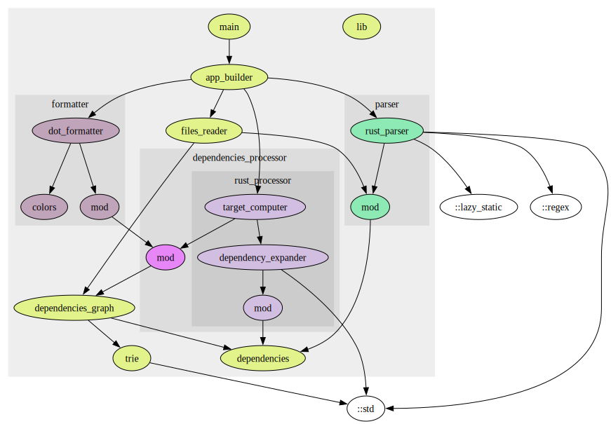

<!--
 Copyright 2023 Thomas Hügel.
 This file is part of Cargo Graphmod.
 SPDX-License-Identifier: GPL-3.0-only
-->


# Cargo Graphmod

A `cargo` subcommand for building Graphviz DOT files of dependency graphs between the modules of a package.


## Prerequisites

* You need to install [Graphviz](https://graphviz.org/).


## Installing

`cargo-graphmod` can be installed with `cargo install`:

```ignore
cargo install cargo-graphmod
```

## Usage

```ignore
cd my_rust_package
cargo graphmod | tred | dot -Tsvg > modules.svg
```

* Assumptions:
  * You should run the command from the root of your project (just above `src`).
  * By default, the package name (as defined in `Cargo.toml`) is supposed to be the directory name. Otherwise pass it as argument: `cargo graphmod a_different_name`.
* Use `tred` if you want the transitive reduction of the graph.
* You can export to [a lot of different formats](https://graphviz.org/docs/outputs/).


## Known limitations

* Detects only dependencies introduced by the `use` keyword.
* Detects only dependencies before the first `#[cfg(test)]` (in order to eliminate the dependencies from unit tests).
* Works best when there is a bijection between modules and files / directories.


## License

`cargo-graphmod` is released under the terms of the GPLv3 license.


## Cargo Graphmod's graph




## Another example with directories

